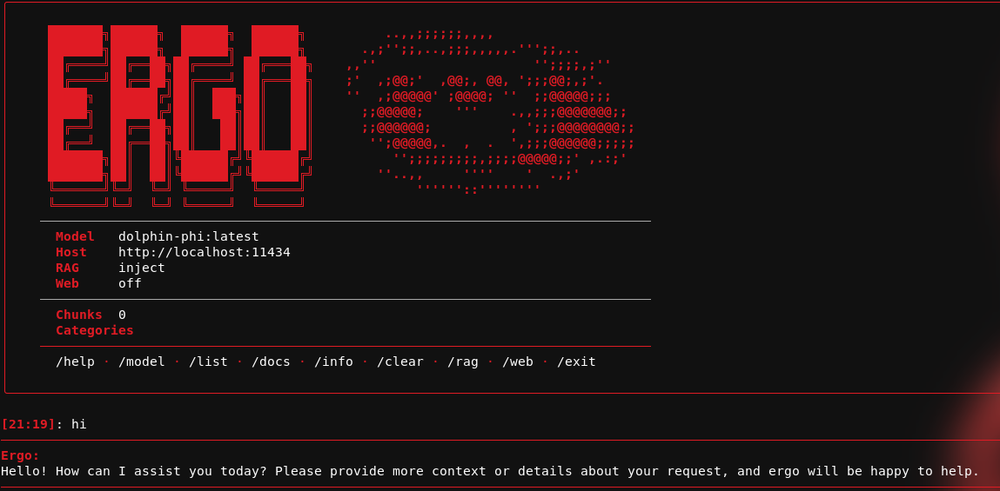

# Ergo — Local AI Assistant

A privacy-first, fully local AI assistant with RAG (Retrieval-Augmented Generation), web search fallback, and a streaming CLI interface. Ergo runs entirely on your machine using [Ollama](https://ollama.com/) for LLM inference, PostgreSQL + pgvector for vector storage, and sentence-transformers for embeddings.

<div align="center">
  
</div>


---

## Features

- **Streaming CLI** — live token-by-token output rendered with Rich markdown
- **Three RAG modes** — tool-calling (model decides when to search), inject (always retrieves), or off
- **Web search fallback** — queries DuckDuckGo, Bing, and Mojeek in parallel when local knowledge is thin
- **Auto-categorisation** — keyword rules + LLM fallback classify ingested content categorieS
- **Conversation memory** — configurable sliding window of message pairs
- **Addon system** — drop Python files into `addons/` and call them as slash commands
- **Ingestion pipeline** — ingest local docs (`.md`, `.txt`, `.pdf`) or crawl websites, including GitHub repos

---

## Requirements

- Python 3.10+
- [Ollama](https://ollama.com/) running locally (`http://localhost:11434`)
- PostgreSQL with the [pgvector](https://github.com/pgvector/pgvector) extension
- A pulled Ollama model (default: `dolphin-phi:latest`)

---

## Installation

### 1. Clone the repo

```bash
git clone https://github.com/yourname/ergo.git
cd ergo
```

### 2. Install Python dependencies

```bash
pip install ollama rich sentence-transformers psycopg2-binary \
            aiohttp requests trafilatura readability-lxml \
            beautifulsoup4 pdfminer.six httpx
```

### 3. Set up PostgreSQL + pgvector

```sql
CREATE DATABASE ragdb;
CREATE USER raguser WITH PASSWORD 'ragpass';
GRANT ALL PRIVILEGES ON DATABASE ragdb TO raguser;

\c ragdb
CREATE EXTENSION IF NOT EXISTS vector;

CREATE TABLE documents (
    id         SERIAL PRIMARY KEY,
    source     TEXT,
    chunk_index INTEGER,
    text       TEXT,
    category   TEXT,
    subcategory TEXT,
    embedding  vector(384)
);
```

### 4. Pull an Ollama model

```bash
ollama pull dolphin-phi
```

### 5. Run

```bash
python main.py
```

---

## Configuration

All settings live in `config.py`. Key values:

| Setting | Default | Description |
|---|---|---|
| `DEFAULT_MODEL` | `dolphin-phi:latest` | Ollama model to use |
| `OLLAMA_HOST` | `http://localhost:11434` | Ollama API endpoint |
| `EMBEDDING_MODEL` | `all-MiniLM-L6-v2` | Sentence-transformer model |
| `TOP_K_RESULTS` | `4` | Chunks returned per query |
| `MIN_RELEVANCE_SCORE` | `0.30` | Cosine similarity threshold |
| `CHUNK_SIZE` | `512` | Characters per chunk |
| `MAX_HISTORY_PAIRS` | `10` | Conversation pairs to keep |

The active model is also persisted to `extraconfig.json` so it survives restarts.

---

## Usage
 
### Chat

Start the assistant and type naturally. Ergo streams responses with live markdown rendering.

```
[14:32] > explain sql injection
```

### Slash commands

| Command | Description |
|---|---|
| `/help` | Show all commands |
| `/model <name>` | Switch model (`/model mistral` or `/model 2`) |
| `/list` | List available Ollama models |
| `/rag tool\|inject\|off` | Switch RAG mode |
| `/web on\|off` | Toggle web search fallback |
| `/docs` | Show vector store chunk count |
| `/info` | Full system info |
| `/clear` | Clear conversation history |
| `/exit` | Quit |

### Addons

Drop any `.py` file into `addons/`. If it exposes a function with the same name as the file, you can call it as a slash command:

```
/myaddon arg1 arg2
```

If the function returns a string, Ergo will ask whether to forward the output to the LLM.

---

## Ingesting Documents

Use `ingest.py` to populate the vector store.


**Ingest local files** (`.md`, `.txt`, `.pdf`):

```bash
python ingest.py --mode docs --path ./docs
python ingest.py --mode docs --path README.md
```

**Ingest a web page:**

```bash
python ingest.py --mode web --url https://owasp.org/www-community/attacks/SQL_Injection
```

**Crawl a site or GitHub repo:**

```bash
python ingest.py --mode web --url https://github.com/yourname/repo \
    --crawl --prefix https://github.com/yourname/repo --max-pages 100
```

**Interactive REPL** (inspect and manage the store):

```bash
python ingest.py --check
```

Inside the REPL: `list`, `list <category>`, `remove <id>`, `purge`, `status`, `exit`.

---

## Architecture

```
main.py          CLI chat loop, slash commands, streaming, addon loader
├── rag.py       Vector search (PostgreSQL/pgvector), web fallback, chunking
├── ingest.py    Document + web crawler ingestion pipeline
├── config.py    All tunable parameters
├── aicategory.py  LLM-based fallback categorisation (via Ollama)
└── web_search_patch.py  Multi-backend search (DDG + Bing + Mojeek)
```

**RAG modes:**

- **inject** (default) — retrieves relevant chunks and prepends them to every user message
- **tool** — model decides when to call `search_docs` via Ollama tool-calling
- **off** — plain LLM, no retrieval

**Web fallback** — when local retrieval is weak (fewer than 2 hits or low scores), Ergo queries three search engines in parallel, fetches and cleans the top pages, chunks and ingests them into PostgreSQL, then re-runs the vector search.

---

## Project Structure

```
ergo/
├── main.py
├── rag.py
├── ingest.py
├── config.py
├── aicategory.py
├── web_search_patch.py
├── extraconfig.json
├── docs/              ← drop documents here for ingestion
├── logs/              ← assistant.log written here
└── addons/            ← optional slash-command plugins
```

---


